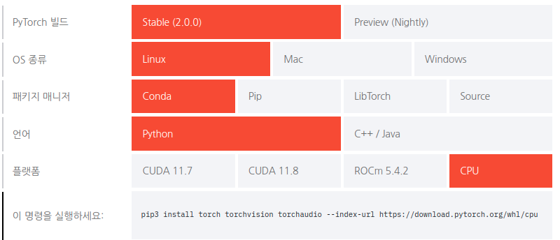

---
title: Install pytorch, Anaconda, and Jupyter notebook
...

## Install pytorch and Anaconda

Reference : https://pytorch.kr/get-started/locally/

To set up pytorch development environment, first select the development environment and language version from [**pytorch.org**](https://pytorch.org/) and install


### Install pytorch
Run command in host PC
```
$ pip3 install torch torchvision torchaudio --index-url https://download.pytorch.org/whl/cpu
```

### Install python
Run command in host PC
```
sudo apt install python
```

### Install Anaconda
Run command in host PC
```
# The version of Anaconda may be different depending on when you are installing`
curl -O https://repo.anaconda.com/miniconda/Miniconda3-latest-Linux-x86_64.sh
sh Miniconda3-latest-Linux-x86_64.sh

```

### How to use Conda
A virtual environment can be created with the conda create -n {envname} command. 
The -n option sets the name of the virtual environment. 
You can enter it easily so that you can use it later when using or deleting the virtual environment. 
Let’s create a virtual environment where python3 can be used with the name ‘songgot’ as follows.
```
(base) hyunil@hyunil$ conda create -n songgot python=3
```
You can check the created virtual environments through the conda info --envs or conda env list command.
```
(base) hyunil@hyunil ~$ conda info --envs
# conda environments:
#
base                  *  /home/hyunil/miniconda3
songgot                  /home/hyunil/miniconda3/envs/songgot
```
To see more details about the currently active virtual environment, type conda info. Currently, the base virtual environment is activated, so information about the base virtual environment appears.
```
(base) hyunil@hyunil ~$ conda info

     active environment : base
    active env location : /home/hyunil/miniconda3
            shell level : 1
       user config file : /home/hyunil/.condarc
 populated config files : 
          conda version : 23.9.0
    conda-build version : not installed
         python version : 3.11.5.final.0
       virtual packages : __archspec=1=x86_64
                          __cuda=12.3=0
                          __glibc=2.31=0
                          __linux=5.15.0=0
                          __unix=0=0
       base environment : /home/hyunil/miniconda3  (writable)
      conda av data dir : /home/hyunil/miniconda3/etc/conda
  conda av metadata url : None
           channel URLs : https://repo.anaconda.com/pkgs/main/linux-64
                          https://repo.anaconda.com/pkgs/main/noarch
                          https://repo.anaconda.com/pkgs/r/linux-64
                          https://repo.anaconda.com/pkgs/r/noarch
          package cache : /home/hyunil/miniconda3/pkgs
                          /home/hyunil/.conda/pkgs
       envs directories : /home/hyunil/miniconda3/envs
                          /home/hyunil/.conda/envs
               platform : linux-64
             user-agent : conda/23.9.0 requests/2.31.0 CPython/3.11.5 Linux/5.15.0-88-generic ubuntu/20.04.3 glibc/2.31
                UID:GID : 1000:1000
             netrc file : None
           offline mode : False

```
#### Enter virtual environment
```
conda info --envs
conda activate songgot
python
Python 3.11.5 (main, Sep 11 2023, 13:54:46) [GCC 11.2.0] on linux
Type "help", "copyright", "credits" or "license" for more information.
>>> 

Ctrl + Z

```
#### Install torchvision and jupyter notebook
```
conda activate songgot
conda install pytorch torchvision -c pytorch
conda install jupyter
conda deactivate
```

#### Run jupyter notebook
```
conda activate songgot
jupyter notebook
```