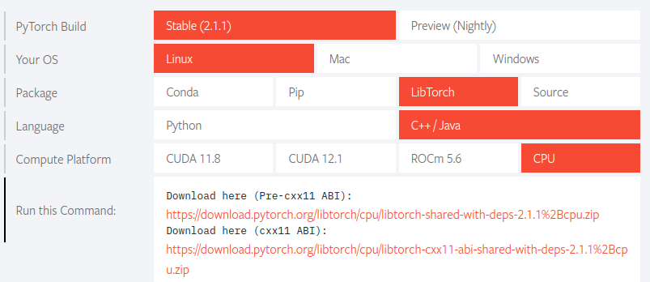

---
title: Development enviroment for libtorch
...

## Development enviroment for libtorch

To set up the libtorch development environment, first select the development environment and language version from [**pytorch.org**](https://pytorch.org/) and download the source and unzip it



### Download and unzip

```
[Download]
wget https://download.pytorch.org/libtorch/cpu/libtorch-cxx11-abi-shared-with-deps-2.1.1%2Bcpu.zip

[unzip]
unzip libtorch-cxx11-abi-shared-with-deps-2.1.1+cpu.zip
```
Install cmake and build tools.
```
sudo apt install -y build-essential automake cmake cmake-gui git
```
Create a project folder
```
git init torchapp
cd torchapp

mkdir 001_example
cd 001_example
```
### Create CMakeLists.txt
```
# CMakeList.txt
cmake_minimum_required(VERSION 3.0 FATAL_ERROR)
set(NAME 001_example)
project(${NAME})

find_package(Torch REQUIRED)
set(CMAKE_CXX_FLAGS "${CMAKE_CXX_FLAGS} ${TORCH_CXX_FLAGS}")

add_executable(${NAME} main.cpp)
target_link_libraries(${NAME} "${TORCH_LIBRARIES}")
set_property(TARGET ${NAME} PROPERTY CXX_STANDARD 17)
```
### Write example code.
```
/*main.cpp */

#include <torch/torch.h>
#include <iostream>

int main() {
	torch::Tensor tensor = torch::eye(3);
	std::cout << tensor << std::endl;
}
```
### How to Build
For -DCMAKE_PREFIX_PATH, use the absolute path to libtorch.

```
sudo rm -rf build
cmake -B build -DCMAKE_INSTALL_PREFIX=/home/hyunil/libtorch 
make -C build
or
cd build; cmake --build . --config Release
```
### How to Run
```
cd build
./001_example
 1  0  0
 0  1  0
 0  0  1
[ CPUFloatType{3,3} ]
```
### Reference
[Installing C++ Distributions of PyTorch](https://pytorch.org/cppdocs/installing.html)